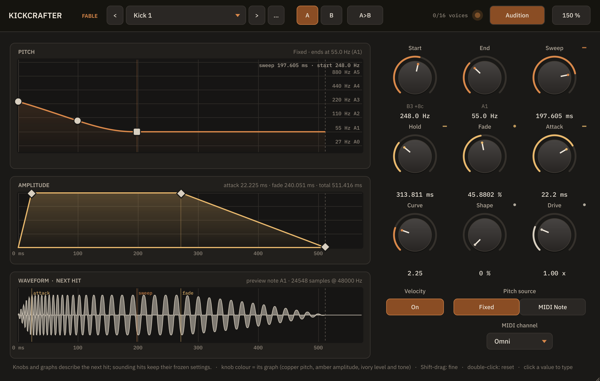
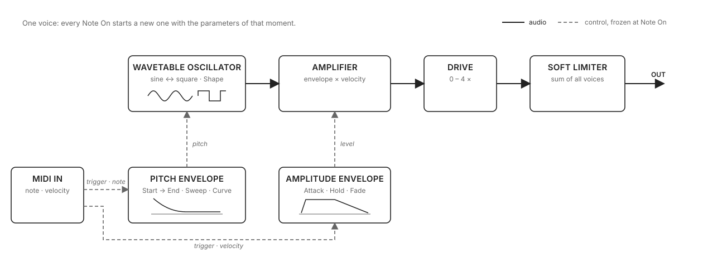

# KickCrafter

A kick-drum synthesizer plug-in. One kick per instance, played with MIDI, every hit frozen the
moment it starts.

KickCrafter is a VST3 instrument for Linux, macOS and Windows, and an Audio Unit on macOS. The
sound is a wavetable oscillator morphing between sine
and square, a pitch sweep with an adjustable curve, an attack / hold / fade envelope, per-hit drive
and a soft limiter. Every Note On snapshots all parameters into the new voice, so knobs, graph
handles, automation, presets and A/B switching only ever shape the *next* hit: voices already
sounding are never retuned.

- Sixteen voices, so fast rolls and long tails overlap without cutting each other.
- Pitch, amplitude and waveform graphs that draw the next hit and can be dragged.
- Factory and user presets, A/B comparison, a resizable window.
- Free software, AGPL-3.0-or-later.

## Installation

Download the archive for your platform from the
[releases page](https://github.com/ArnaudValensi/kickcrafter/releases) (or build from source, a
few minutes: [docs/development.md](docs/development.md#building-from-source)), extract it, copy the
bundle where your host looks for plug-ins, and rescan plug-ins. Every archive holds an
`INSTALL.txt` with the same instructions, the licences and the changelog. The plug-in appears as
**KickCrafter Fable** (vendor Arnaud Valensi) in the instrument list; insert it on a track and send
it MIDI notes.

### Linux (x86_64, VST3)

`kickcrafter-fable-<version>-linux-x86_64.tar.gz`. Copy `KickCrafter Fable.vst3` into a folder your
host scans, for example `~/.vst3/`. Like the other two, this binary is compiled and unit-tested by
continuous integration. Linux is also the platform the maintainer validates: before each release, a
local build of the same sources goes through the Steinberg validator, the plug-in tests, the REAPER
host harness and the memory gate ([docs/development.md](docs/development.md)), and that build's
evidence archive is attached to the release. The downloaded binary is not that local build
(another compiler produced it), only its sources are.

### macOS (Apple Silicon and Intel, VST3 and Audio Unit)

`kickcrafter-fable-<version>-macos-universal.zip`, macOS 11 or later. Copy `KickCrafter Fable.vst3`
into `~/Library/Audio/Plug-Ins/VST3/` and `KickCrafter Fable.component` into
`~/Library/Audio/Plug-Ins/Components/` (Logic and GarageBand load the Audio Unit, most other hosts
the VST3). Releases are signed with a Developer ID and notarized; `INSTALL.txt` says so, or says
what to do when a build is not. This build is compiled and unit-tested by the project's continuous
integration; it has not yet been validated in a host by the maintainer.

### Windows (x64, VST3)

`kickcrafter-fable-<version>-windows-x86_64.zip`. Copy `KickCrafter Fable.vst3` into
`C:\Program Files\Common Files\VST3\`. This build is compiled and unit-tested by the project's
continuous integration; it has not yet been validated in a host by the maintainer, and it is not
code-signed.

## Playing it

- **Notes.** Every MIDI channel is accepted by default; **MIDI Channel** restricts input to one
  channel. Note Off is ignored: hits are one-shot and end by themselves. A Note On with velocity 0
  does not trigger.
- **Pitch Source.** *Fixed* (default): the **End** knob is the note of the kick and the played note
  number is ignored (55 Hz = A1). *MIDI Note*: the played note sets the end frequency of the sweep,
  so the kick can be played melodically.
- **Velocity.** On (default): the MIDI velocity scales the level linearly, a velocity-96 note plays
  at 96/127 of the level. Off: every note plays at full level.
- **Audition** fires an A1 hit at full velocity through the same path as a MIDI note.
- **Knobs.** Drag, mouse wheel, Shift for fine control, double-click to reset, click the value to
  type it (`440`, `440 Hz`, or a note name such as `A1` or `C#2` for the frequency knobs). The arc
  colour of a knob is the colour of the graph that edits the same value: copper = pitch graph,
  amber = amplitude graph, ivory = level and tone.
- **Graphs.** Circles move frequencies, diamonds move times, the square knee moves the sweep time.
  Dragging a time handle past the right edge keeps growing the value; the axis rescales on release.
  Shift-drag is fine, double-click resets the handle's parameter. The waveform shows the next hit
  with markers for the attack, the end of the sweep and the start of the fade.
- **A/B.** `A` and `B` hold two complete settings; `A>B` copies the current one into the other slot.
  Both slots are saved with the project.
- **Window size.** Drag the host window corner (80–160 %) or pick a size in the `%` menu. The size
  is saved with the project.

## Parameters

| Name | Range | Default | What it does |
|---|---|---|---|
| Start Frequency | 20–2000 Hz | 250 Hz | where the pitch sweep starts |
| End Frequency | 20–440 Hz | 55 Hz | the note of the kick (Pitch Source = Fixed) |
| Sweep Time | 0–250 ms | 47 ms | how long the pitch takes to reach End |
| Sweep Curve | 1–30 | 1 | 1 = straight pitch drop, higher = the pitch drops faster at first |
| Hold Time | 0–1000 ms | 132 ms | how long the hit continues after the sweep (hit = sweep + hold) |
| Attack | 0.4–50 ms | 0.4 ms | ramp-in at the start of the hit |
| Fade Out | 0–100 % | 50 % | fade-out length as a fraction of the hit (0 % = 10 ms, 100 % = the whole hit) |
| Shape | 0–100 % | 0 % | 0 = sine, 100 = square |
| Drive | 0–4 × | 1 × | per-hit gain before the limiter; above 1 × it saturates |
| Velocity Sensitivity | Off / On | On | whether MIDI velocity scales the level |
| Pitch Source | Fixed / MIDI Note | Fixed | where the end frequency comes from |
| MIDI Channel | Omni, 1–16 | Omni | input channel filter |

All twelve can be automated. Automation is applied at block boundaries; MIDI notes are
sample-accurate. Projects saved by earlier versions load as they were; the
[changelog](CHANGELOG.md) lists the few controls to check when a parameter's meaning changed.

## How it works

The audio path is the classic one-oscillator kick: an oscillator, an amplifier, a gain stage and a
limiter. Everything that shapes a hit is a modulation source, and every Note On freezes all of them
into the new voice: a sounding hit never changes, controls only shape the next one.

| Module | What it does | Parameters |
|---|---|---|
| Wavetable oscillator | Reads a 2048-point table by linear interpolation; the waveform is a morph between the sine table and the square table. | Shape |
| Pitch envelope | Sweeps the oscillator frequency from Start to End over the sweep time along `start + (end - start) · (1 - (1 - t)^curve)`, then holds End. In MIDI Note mode the played note sets End. | Start, End, Sweep, Curve, Pitch Source |
| Amplitude envelope | Linear attack, hold at full level, linear fade to silence; the hit lasts sweep + hold, the fade is a fraction of it. | Attack, Hold, Fade |
| Amplifier | Envelope level × MIDI velocity (127 = full) when the Velocity switch is on, envelope level alone when it is off. | Velocity |
| Drive | Per-hit gain, 0 to 4 ×, applied inside the voice so it is frozen with the rest. | Drive |
| Soft limiter | `x · (27 + x²) / (27 + 9x²)` on the sum of all voices, clamped to ±1 for |x| ≥ 3. The only stage shared by the voices. | none |

There is no filter, no LFO and no second oscillator: the character comes from the sweep curve, the
sine-to-square morph and the drive into the limiter. Sixteen voices; when all are busy the one
closest to its end is stolen with a short fade so a steal never clicks. The square table is not
band-limited, on purpose.

## Presets

The preset list has a *Factory* section (eight presets shipped in the plug-in) and a *User* section
(your own). The `...` button saves, renames, deletes, opens the user presets folder and rescans it.
User presets are plain XML files, one per preset, easy to back up or share, in
`~/.config/KickCrafterFable/Presets/` on Linux, `~/Library/Application Support/KickCrafterFable/Presets/`
on macOS and `%APPDATA%\KickCrafterFable\Presets\` on Windows (the `KCF_PRESET_DIR` environment
variable overrides the folder); "• edited" after a name means the current values differ from the
loaded preset.

## Known limitations

- Linux x86_64 VST3, macOS universal VST3 and AU, Windows x64 VST3. No LV2, CLAP, AUv3 or AAX.
  The downloadable binaries are compiled and unit-tested by continuous integration; only a Linux
  build of the release sources is validated in a host by the maintainer (see Installation).
- No pitch bend, MPE, LFOs, multi-point envelopes, sample import, sequencer, kit or WAV export.
- The square waveform is not band-limited (about 21 dB of aliasing below the harmonics at
  44.1/48 kHz, 25 dB at 96 kHz), by design. Use Shape below 100 % or a higher sample rate for
  cleaner square-heavy sounds.

## Documentation

- [docs/development.md](docs/development.md): building, tests, validation and packaging.
- [CHANGELOG.md](CHANGELOG.md).

## Licence

KickCrafter is free software under the GNU Affero General Public License, version 3 or later
(`LICENSE`). It uses JUCE under its AGPLv3 option, the Steinberg VST3 SDK under GPLv3 and the
IBM Plex fonts under the SIL Open Font License; see `THIRD_PARTY_NOTICES.md`. VST is a trademark of
Steinberg Media Technologies GmbH.
