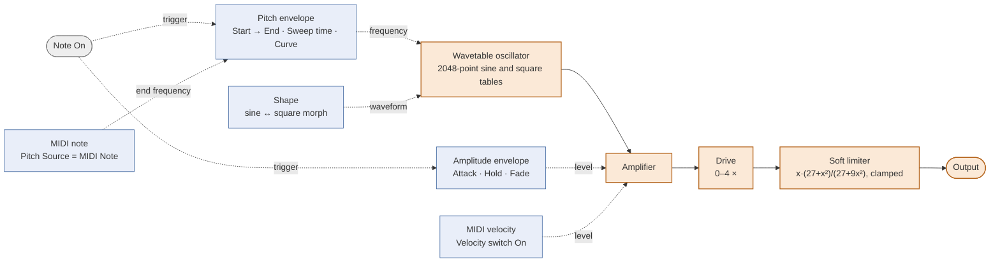

# Architecture

Three layers that do not leak into each other:

- `engine/`: the synthesis, plain C++ with no JUCE dependency (parameters, voice, voice pool, limiter).
- `plugin/`: the JUCE integration (host parameters, MIDI, state, presets, A/B).
- `plugin/ui/`: the editor (knobs, graphs, top bar), which only ever talks to the host parameters.

## Synthesis

The audio path is the classic one-oscillator kick: an oscillator, an amplifier, a gain stage and a
limiter. Everything that shapes a hit is a modulation source frozen at Note On.

| Module | What it does | Parameters |
|---|---|---|
| Wavetable oscillator | Reads a 2048-point table by linear interpolation; the waveform is a morph between the sine table and the square table. | Shape |
| Pitch envelope | Sweeps the oscillator frequency from Start to End over the sweep time along `start + (end - start) · (1 - (1 - t)^curve)`, then holds End. In MIDI Note mode the played note sets End. | Start, End, Sweep, Curve, Pitch Source |
| Amplitude envelope | Linear attack, hold at full level, linear fade to silence; the hit lasts sweep + hold, the fade is a fraction of it. | Attack, Hold, Fade |
| Amplifier | Envelope level × MIDI velocity (127 = full) when the Velocity switch is on, envelope level alone when it is off. | Velocity |
| Drive | Per-hit gain, 0 to 4 ×, applied inside the voice so it can be frozen with the rest. | Drive |
| Soft limiter | `x · (27 + x²) / (27 + 9x²)` on the sum of all voices, clamped to ±1 for |x| ≥ 3. The only stage shared by the voices. | none |

There is no filter, no LFO and no second oscillator: the character comes from the sweep curve, the
sine-to-square morph and the drive into the limiter. The square table is not band-limited, on purpose.

## One hit, one snapshot

Every Note On freezes all synthesis parameters, the note and the velocity into the new voice. From
then on the voice reads nothing else: knobs, graph handles, automation, presets and A/B switching
only shape the *next* hit, and voices already sounding are never retuned. Sixteen voices; when all
are busy, the one closest to its natural end is stolen and its output is faded out with a short ramp
so a steal never clicks.

## Realtime rules

- `processBlock` reads the parameter atomics once, renders the voice pool straight into the host
  buffer and parses MIDI at sample offsets. It takes no lock, allocates nothing and posts nothing.
- The editor polls the parameters from a 30 Hz timer; it never installs listeners, so nothing is
  pushed to it from the audio thread. Its edits go through begin / value / end gestures.
- Presets, A/B and state save/restore are message-thread transactions under one lock, so a saved
  project always holds a coherent combination of current values, other slot and preset identity.
- No host "Program" parameter is published: presets live in the editor and in the saved state.

## Parameters, state and presets

The twelve parameter IDs are stable and never renamed. Project state is XML with a schema number;
every schema is still read and older documents are migrated on load (only the plug-in's own state:
host-side copies such as automation lanes keep their numbers, see the changelog). Presets are XML
files with the eleven synthesis values in display units (format in the README); the factory bank is
embedded from `resources/presets/`, the user library is one folder scanned on demand.
