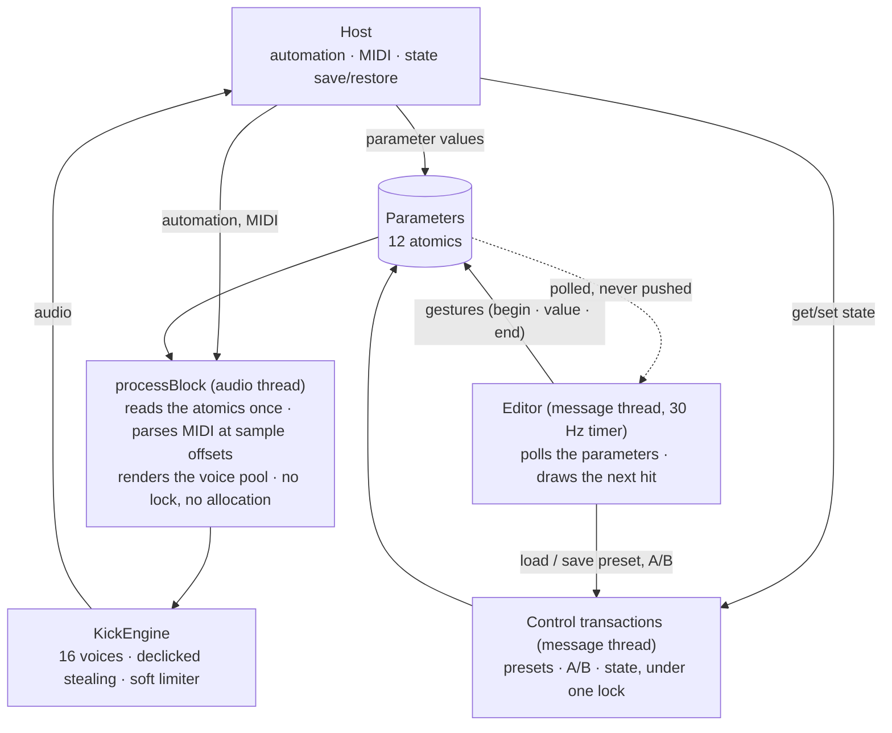

# Architecture

KickCrafter is split into three layers that never leak into each other: a JUCE-free synthesis
engine, the plug-in integration (parameters, MIDI, state, presets) and the editor.

```
engine/       KickParams.h   values, bounds, sanitize(); defaults written as display-unit divisions so
                             engine and plug-in defaults are bit-identical
              SoftClip.h     DaisySP's SoftLimit rational curve, clamped to ±1 for |x| >= 3
              KickEngine.*   Wavetables, VoiceSnapshot::make, KickVoice (declick ramp), KickEngine
                             (16 voices), renderSingleHit (previews and tests)
plugin/       Parameters.*   the 12 APVTS parameters (string IDs, log ranges, text conversions,
                             note names), DisplayValues <-> KickParams helpers
              Presets.*      factory bank parsed from the embedded resources/presets/*.xml, user
                             Library on disk, strict fromXml / toXml
              PluginProcessor.* MIDI as raw bytes at sample offsets, one KickParams snapshot per
                             block, A/B and presets as control transactions, versioned XML state
              PluginEditor.* 1000 x 640 logical layout, affine scale 80-160 %, 30 Hz polling timer
plugin/ui/    Theme (palette, embedded IBM Plex, LookAndFeel), Knob (slider + polled binding +
              validated text entry), Graphs (pitch / amplitude / waveform timeline with draggable
              handles), TopBar (presets, A/B, audition, note LED, scale), PolledBinding.h
resources/    fonts (IBM Plex, OFL) and factory presets, compiled into the binary (KcfAssets)
tests/        engine_tests (JUCE-free, sanitizer-capable), plugin_tests (real processor + editor),
              leak_tests (lifecycle cycles for LeakSanitizer), vst3_host_lifecycle (a minimal real
              VST3 host without JUCE)
tools/        build/test chain, VST3 validator wrapper, REAPER host harness, memory gate, packaging
```

## Synthesis


The audio path is the classic one-oscillator kick: an oscillator, an amplifier, a gain stage and a
limiter. Everything that shapes a hit is a modulation source frozen at Note On.

| Module | What it does | Parameters |
|---|---|---|
| Wavetable oscillator | Reads a 2048-point table by linear interpolation; the waveform is a morph between the sine table and the naive square table. | Shape |
| Pitch envelope | Sweeps the oscillator frequency from Start to End over the sweep time along `start + (end - start) · (1 - (1 - t)^curve)`, then holds End. In MIDI Note mode the played note sets End. | Start, End, Sweep, Curve, Pitch Source |
| Amplitude envelope | Linear attack, hold at full level, linear fade to silence; the hit lasts sweep + hold, the fade is a fraction of it. | Attack, Hold, Fade |
| Amplifier | Envelope level × MIDI velocity (127 = full) when the Velocity switch is on, envelope level alone when it is off. | Velocity |
| Drive | Per-hit gain, 0 to 4 ×, applied inside the voice so it can be frozen with the rest. | Drive |
| Soft limiter | DaisySP's `SoftLimit` on the sum of all voices, clamped to ±1 for |x| ≥ 3. The only stage shared by the voices. | none |

There is no filter, no LFO and no second oscillator: the character comes from the sweep curve, the
sine-to-square morph and the drive into the limiter.

## The per-hit snapshot rule

Every Note On freezes **all** synthesis parameters into the new voice. `processBlock` reads the
parameter atomics once per block into a `KickParams` and passes that copy to `KickEngine::noteOn`,
which derives a `VoiceSnapshot`: frequencies, times in samples, curve, morph, gain × velocity.
Voices only read their snapshot. Knobs, graph handles, host automation, presets, A/B and state
restores therefore only shape the next hit; voices already sounding are never retuned. Morph
(Shape) and gain (Drive), which the Daisy firmware read live, are frozen too. Graphs and knobs
describe "the next hit".

Trigger A; change every control halfway through A; A's trajectory is unchanged. Trigger B while A's
tail continues; B uses the new values. The fixed bus limiter reacts to the sum of voices, which is
not a parameter leak.

## Sound

- **Oscillator.** 2048-point sine and square wavetables reproduced from the firmware, linear
  interpolation, morph between the two tables. The square table is naive: with a steady 440 Hz pure
  square the aliased energy is about 21 dB below the harmonics at 44.1/48 kHz and 25 dB at 96 kHz.
  No anti-aliasing is applied, by choice.
- **Pitch sweep.** `start + (end - start) * (1 - (1 - t)^curve)` during the sweep, then the end
  frequency. Phase is kept normalised in double precision (the firmware accumulated radians in
  float and drifted over long tails).
- **Envelope.** Linear attack, hold, linear fade with clamped interpolation. Attack is clamped to
  the hit length; attack and fade multiply, so a long attack over a short hit is continuous (the
  firmware jumped). Fade is the reference remap (0 % = 10 ms fade, 100 % = the whole hit) clamped to
  the hit. Zero-length hits allocate no voice. Durations round to the nearest sample.
- **Velocity.** Linear, applied once, before the limiter, when the Velocity Sensitivity switch is
  on; off means every note at full level.
- **Gain and limiting.** The firmware computed `SoftLimit(gain × Σ voices)`. Here the per-hit gain
  is applied inside each voice (so it can be frozen), the voices are summed, and a fixed bus
  `softClip` follows: DaisySP's `SoftLimit`, `x·(27 + x²) / (27 + 9x²)`, clamped to ±1 for
  |x| ≥ 3 where the polynomial reaches exactly ±1 (DaisySP's own `SoftClip`). For one voice this
  equals the reference; for equal gains the summed result is identical too. The clamp exists because
  the bare rational function is unbounded (7.15 at x = 64, the worst case of 16 voices at 4 ×).
- **Voice pool.** 16 voices. When all are busy, the voice closest to its natural end is stolen. The
  interrupted output continues as a 64-sample linear ramp added to the slot; that ramp is carried
  (or exactly cancelled) if the slot is interrupted again, so repeated steals and All Sound Off never
  produce a step.
- **MIDI Note mode** sets the end frequency to `440 · 2^((note - 69) / 12)` clamped to 20–2000 Hz.
- **Output** is dual mono (the firmware wrote the left channel only).

## Realtime invariants



`processBlock` reads the parameter atomics, renders the fixed voice pool straight into channel 0 and
copies it to channel 1, parses MIDI bytes at their sample offsets and publishes a few atomics
(last note, velocity, voice count). It takes no lock, allocates nothing and never touches presets,
A/B, state or the UI. Nothing is posted from the audio thread.

Everything else is a *control transaction* on the message thread: state save and restore, preset
loads, A/B toggle and copy each hold one non-realtime recursive lock for their whole duration, with
a before-snapshot, so a saved state always contains a coherent current / other-slot / preset
combination even when a host saves re-entrantly from a parameter callback.

The editor never installs parameter listeners or JUCE attachments: all host-to-UI synchronisation
is polled from its 30 Hz timer through `PolledBinding`, and control edits flow to the parameters
with begin / value / end gestures. What remains is JUCE's own machinery: `setValueNotifyingHost`
briefly holds the framework's parameter listener locks, in the wrapper's automation path as in every
JUCE plug-in. That inherited behaviour is documented rather than claimed away.

No host "Program" parameter is published (`getNumPrograms()` is 1, `setCurrentProgram` is a
no-op): REAPER applies a Program envelope from its processing side, which would force preset loads
into a realtime context where no coherent state transaction can be taken. Presets live in the editor
and in the saved state.

## MIDI and automation

- Any channel by default (the hardware listened to channel 10 only); `MIDI Channel` restricts it.
- Note Off is ignored; hits end by themselves. Velocity 0 never triggers.
- The processor treats CC 120 All Sound Off as an immediate declicked stop of every voice and
  CC 123 All Notes Off as a deliberate no-op. The VST3 exports no synthetic "MIDI CC" parameters
  (JUCE's emulation, 2 080 extra rows in the host's parameter list, is switched off), and VST3
  carries no raw CC events, so CC messages do not reach the plug-in from a VST3 host. The handling
  stays covered by the plug-in tests.
- The JUCE VST3 wrapper applies the last automation point of a block at block start, so a Note On
  sees the parameter values the host delivered for its block. MIDI notes are sample-accurate.

## Parameters, state and presets

The twelve parameter IDs are the compatibility contract and are never renamed:
`startFreq endFreq sweep hold fade attack curve shape drive velocity pitchSource midiChannel`
(version hint 1). Numeric text is parsed strictly: junk is rejected, not clamped.

Project state is XML, `<KickCrafterFable version="N">`, with every parameter, the A/B slot and the
other slot's values, the loaded preset (kind, name, factory index) and the UI scale. Restore
validates and clamps every value; empty, malformed or foreign data is ignored, so a project can never
load NaNs or silence. Schema history:

| Schema | Version | Change |
|---|---|---|
| 1 | 1.0 | initial |
| 2 | 1.1 | Pitch Source choice order reversed (0 = Fixed, 1 = MIDI Note); schema-1 values are inverted on load |
| 3 | 1.2 | preset identity stored as kind + name (older documents map the index to the factory bank) |
| 4 | 1.3 | `velocity` is a switch; older 0–100 % amounts load as On when above 0 |

Only the plug-in's own documents are migrated. Host-side copies of a parameter value (automation
envelopes, stored parameter values, track templates) keep their normalised number and read as the
current version interprets it.

Presets are XML (`<KickCrafterPreset version="4" name="...">` with a `Params` element carrying the
eleven synthesis values in display units). The factory bank is parsed from the embedded
`resources/presets/*.xml` at first use (sorted by file name; an unparsable bank falls back to one
Reference preset). The user library scans one folder, sorted by file name, skips files above 1 MiB,
malformed documents and duplicate names (with reasons shown in the UI), sanitises file names,
rescans before every save / rename / delete, and overwrites in place when a name already exists.
The processor keeps the loaded preset's identity and reference values; "• edited" means the current
values differ from them.

## Editor

A 1000 × 640 logical layout scaled by one affine transform (80–160 %, saved with the project). The
graphs render the next hit offline on the message thread with the same voice code, only when an
input changed. Graph handles have fixed sets relaid on resize and model change; hit-testing feeds
the REAPER mouse-driven tests through `kcf_plugin_tests --layout`. Dialogs (preset name prompt,
confirmations) are owned by the top bar and closed with it, and every dialog continuation checks a
safe pointer, so closing the editor with a dialog open cannot reach a destroyed component.

## Deviations from the hardware, summarised

Clamped limiter; gain applied per voice; attack clamped and multiplied with the fade; double
precision phase; velocity sensitivity (the hardware ignored velocity); any MIDI channel; 16
polyphonic voices with stealing (the hardware was monophonic); block-level automation; no anti-
aliasing, the naive square table is kept for fidelity.
